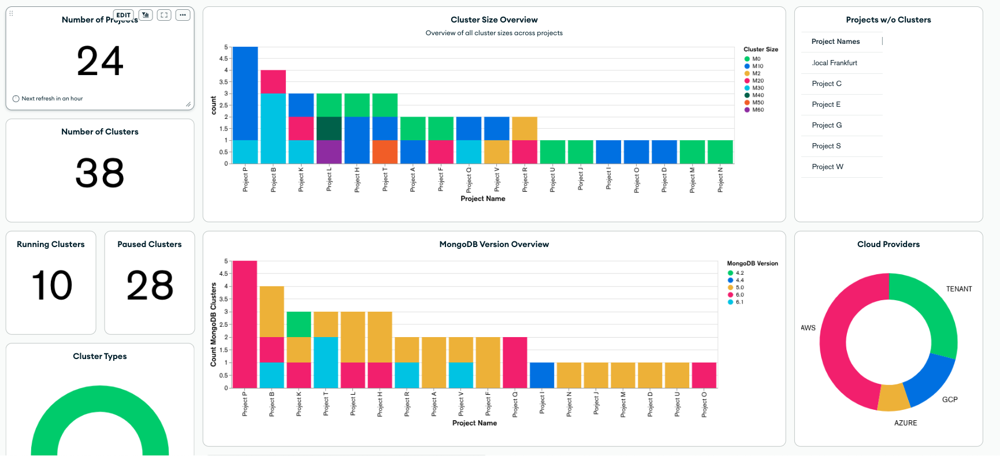

# MongoDB Atlas Cluster Overview using Charts

This is a private repository and is inspired by the MongoDB Atlas Billing Exploration using Charts repository.
[Check out the official MongoDB Atlas Billing Exploration repository.](https://github.com/mongodb/atlas-billing)

This repository includes a MongoDB App Service application which regularly audits all projects of your organization and imports the data to a MongoDB Atlas instance. It also includes a MongoDB Charts dashboard which provides an overview of all running MongoDB Atlas instances within the organization.



# Setup

Setting up this solution involves a number of steps in the Atlas web portal,
followed by some command line scripts to be run locally. Finally you will
open MongoDB Charts to import the dashboard.

## Atlas Portal Steps

1. Sign into [MongoDB Atlas](https://cloud.mongodb.com)
2. Create a new Project within the Atlas Organization which you wish to create the overview dashboard for. Give the project a descriptive name such as `Org Overview`.
3. Deploy a new cluster in this project to store your report data.
   Give your cluster a descriptive name such as `ReportingData`.
4. Create an API Key for the project. This will be used to programmatically
   deploy the App Services app:
   _ Ensure that `Org Overview` is your active project
   _ Click **Access Manager** on the top bar, and then **Project Access**
   _ Click **Create API Key**
   _ Enter an appropriate name for the key, e.g. `Report App Deployment`
   _ Select the `Project Owner` role.
   _ Click **Next**
   _ Record the Public and Private Key details and store them securely.
   _ Add your IP address to the API Access List. \* Click **Done** when you're ready to save the new key to your Project
5. Create an API Key for the Organization. This will be used to authenticate
   to the Atlas APIs:
   _ Ensure that `Org Overview` is your active project
   _ Click **Access Manager** on the top bar, and then **Organization Access**
   _ Click **Create API Key**
   _ Enter an appropriate name for the key, e.g. `Report API Access`
   _ Select the `Organization Read Only` role.
   _ Click **Next**
   _ Record the Public and Private Key details and store them securely.
   _ Click **Done** when you're ready to save the new key to your Organization.

## Local Command Line Steps

1. Install the following prerequisites on your computer if they aren't already
   present:
   * [Git](https://git-scm.com/downloads)
   * [Node.js](https://nodejs.org/en/download/) 
   * [MongoDB Realm CLI](https://www.mongodb.com/docs/atlas/app-services/cli/)
2. Clone this repo to an appropriate directory on your computer:
   ```
   git clone https://github.com/timolackmann/atlas-org-overview.git
   ```
3. Change directory to the cloned project:
   ```
   cd atlas-org-overview
   ```
4. Run the setup script
   ```
   ./setupAtlasOverview.sh
   ```
5. When prompted, enter the public and private API keys for your Organization
   and Project, as well as the name of your cluster.
6. Wait for the script to complete, and then verify that data has been loaded into your cluster.
   Note that the app contains a trigger which will create new reports daily.

## Charts Steps

1. Sign into [MongoDB Atlas](https://cloud.mongodb.com) and select your `Org Overview` project
2. Click the **Charts** tab on the top nav, and activate Charts if you haven't done so already
3. Find the **Add Dashboard** button and click the down arrow, and then select
   **Import Dashboard**
4. Choose the `atlas-overview-template.charts` file from this repo, click **Next**.
5. If the **"Data source at destination"** says **"Connect later"**, click on the edit button next to your data source.
   1. Select **Connect now**
   2. Choose the deployment, collection and database that you created in the previous steps
   3. Click **Save** underneath the dropdown
6. Click the green **Save** button
7. Open the imported dashboard, and start exploring your Atlas deployments!

# Solution Details

The App Services app in this repo contains one function, one trigger and some values & secrets. You
can view and update the deployed app by clicking the **App Services** tab on the top Atlas nav.

### Functions

`createReport`: calls the getProjects function and calls getClusters & getProjectAlerts for each project.

`getProjects`: calls the Atlas API to extract and return an array of all projects.

`getClusters`: calls the Atlas API to extract cluster data and return an array of all clusters of a given project.

`getProjectAlerts`: calls the Atlas API to extract and return and array of all open alerts of a given project.

`getApiTemplate`: this is a helper function and provides the http get object for Atlas API calls.

`getScramUsers`: calls the Atlas API to retrieve all SCRAM database users of a given project. This function is comment out in createReport and can be included if this is a relevant audit objective.

`getOrgsProjects`: **Under Construction** retrieves all projects for a given organization. This will be relevant for the feature of reporting across multiple organizations.

`getLdapStatus`: **Under Construction** calls the Atlas API to validate if LDAP is in use for a given project.

### Values & Secrets

`privateKey`: maps to the Private API key for the Org. `Maps to privateKeySecret`.

`publicKey`: maps to the Public API key for the Org. `Maps to publicKeySecret`.

### Triggers

`auditReport`: runs at 1am GMT each morning to retrieve the deployment informations using the `createReport` function above.

# Enhancements

- In progress: Enable monitoring across multiple organizations
- In progress: Include LDAP database user configuration
- In consideration: Include if KMS is configured
- In consideration: Include API Keys overview

# Documentation Links

- [Official MongoDB Atlas Billing Exploration using Charts](https://github.com/mongodb/atlas-billing)
- [Realm CLI](https://docs.mongodb.com/realm/deploy/realm-cli-reference/)
- [MongoDB Atlas](https://www.mongodb.com/cloud/atlas)
- [MongoDB Charts](https://docs.mongodb.com/charts/master/)
- [Values & Secrets](https://docs.mongodb.com/realm/values-and-secrets/)
- [MongoDB API Resources](https://docs.atlas.mongodb.com/reference/api-resources/)
- [MongoDB University: Introduction to MongoDB Charts](https://university.mongodb.com/courses/A131/about)
